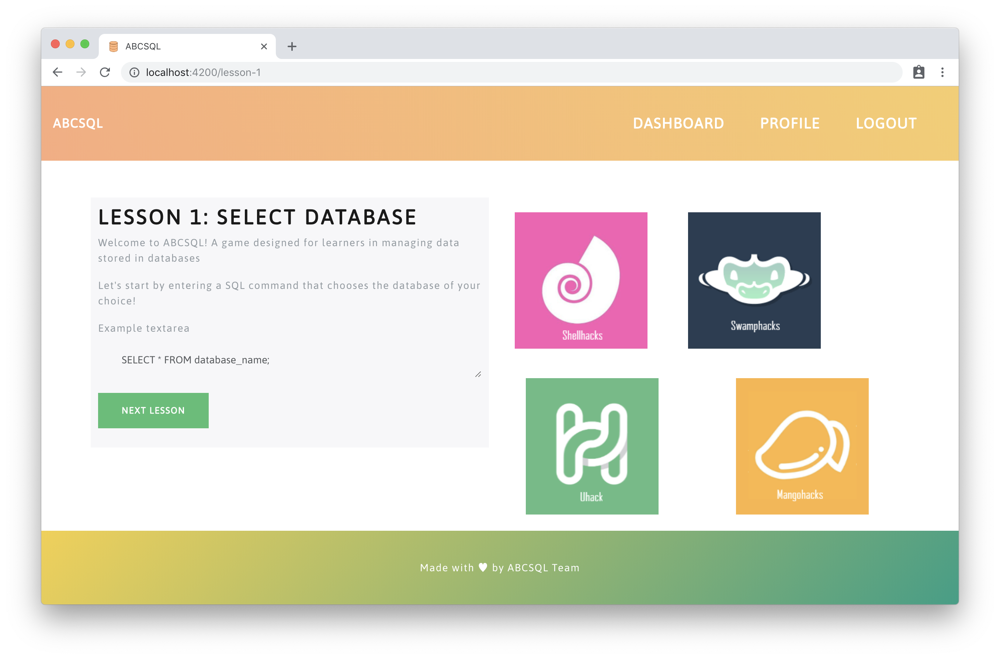
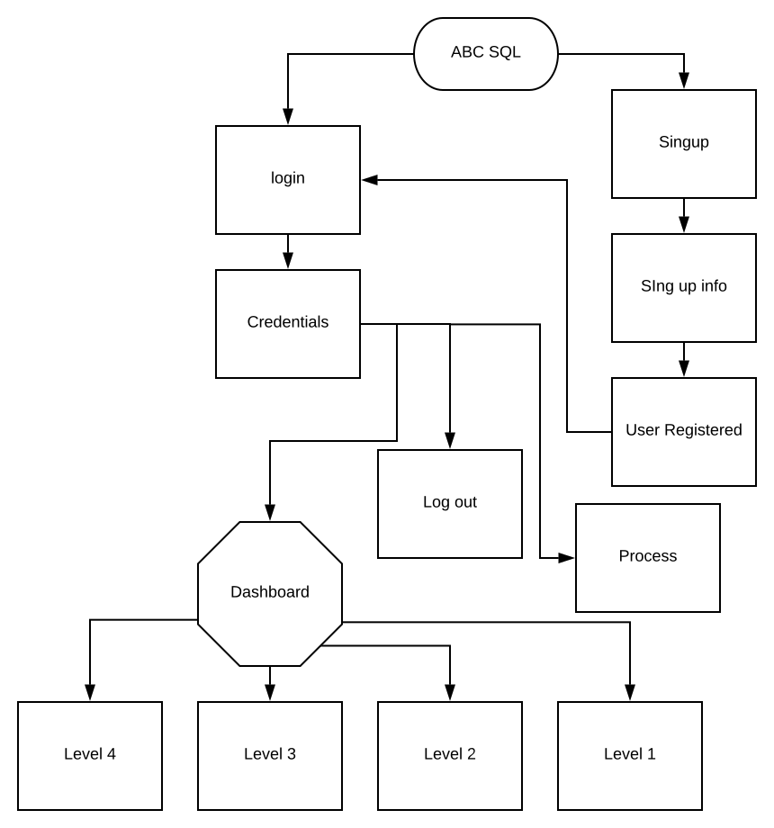

<div align="center" id="top">
	<br>
	<br>
	
	<br>
	<br>
	<br>
	<br>

<p align="center">
  <i>You should know SQL, so we made it easier for you</i>
</p>
<br>

<a href="https://UHack.miami/">
	
</a>
<a href="https://github.com/thehurricanes/abcsql">
	
</a>
<a href="https://github.com/thehurricanes/abcsql">
	
</a>

</div>

## See

- [Inspiration](#inspiration)
- [What it does?](#what-it-does)
- [How we built it?](#how-we-built-it)
- [Diagram](#diagram)
- [Usage](#usage)
- [Team](#team)
- [License](#license)

## Inspiration

SQL is a domain-specific language used in programming and designed for managing data held in a relational database management system, or for stream processing in a relational data stream management system. It is an important skill that every developer should have, and it should be easy to learn 😀.


## What it does?

**ABCsql** is a simple buggy game (web application) that will help you build your skills on SQL. You will need to create an account and start completing the multiple challenges.




## Diagram

You want to understand how our project looks like? Check this...

<p align="center">
	<br>
	
	<br>
</p>

# How we built it?

...

## Usage

Set up the environment from the root directory.

```
$ npm install && cd src/ && npm install
```

This project is build on Angular, so it spect it to have [`@angular/cli`](https://npmjs.org/@angular/cli) installed, then run:

```
$ ng serve
```

The application will be served at http://localhost:4200

## Team

|[![abranhe][abranhe-img]][abranhe]| [![dianelis][dianelis-img]][dianelis]| [![adriel][adriel-img]][adriel]|
| :-: | :-: | :-: |
| [Carlos Abraham][abranhe] | [Dianelis Insua][dianelis] | [Adriel Camargo][adriel] |

<!----------------------------------------------------------------------
Five columns table template

| [![abranhe][avatar-abranhe] <br> <sub>Carlos Abraham</sub>]() | | | | |
| :-: | :-: | :-: | :-: |
---------------------------------------------------------------------->

## License

MIT © The Hurricanes

<div align="center">
	<a href="https://github.com/thehurricanes/abcsql">
		
	</a>
  <br>
</div>

<!-- Maintainers -->
[abranhe-img]: https://avatars2.githubusercontent.com/u/21347264?s=70
[dianelis-img]: https://avatars2.githubusercontent.com/u/25069386?s=70
[adriel-img]: https://avatars2.githubusercontent.com/u/36480978?s=70
[abranhe]: https://github.com/abranhe
[dianelis]: https://github.com/dianelis
[adriel]: https://github.com/adriel1221
