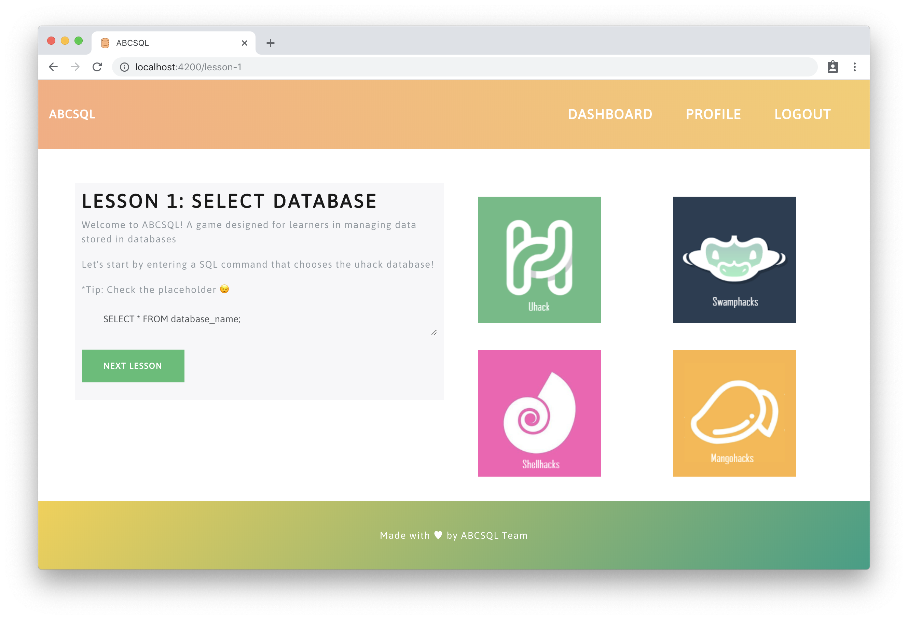
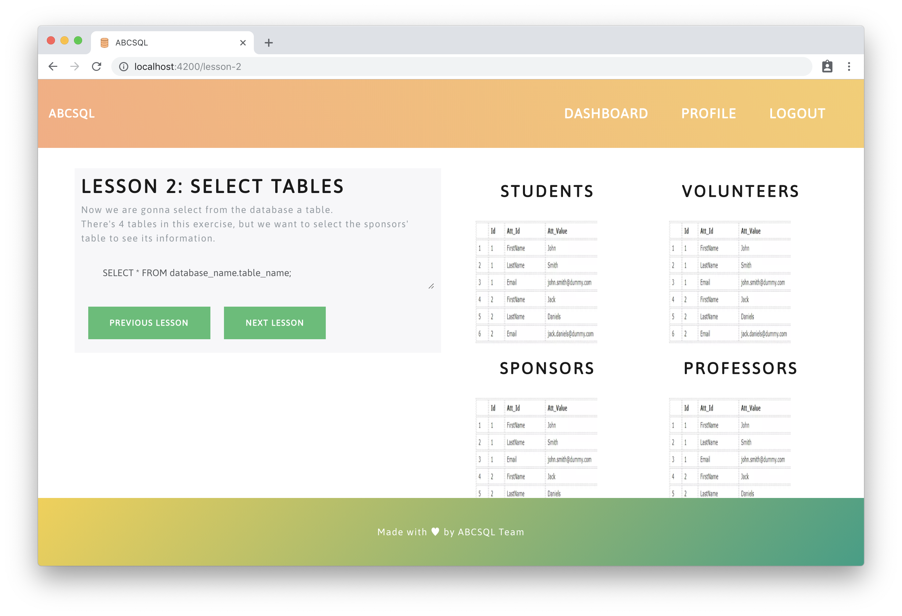
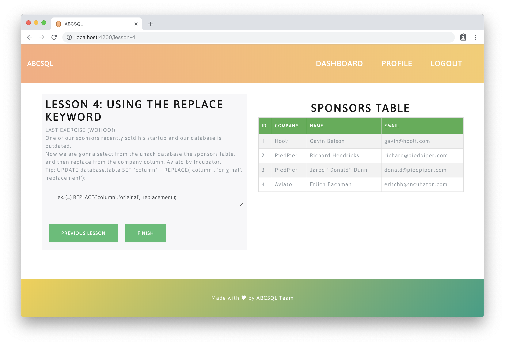

<div align="center" id="top">
	<br>
	<br>
	
	<br>
	<br>
	<br>
	<br>

<p align="center">
  <i>You should know SQL, so we made it easier for you</i>
</p>
<br>

<a href="https://UHack.miami/">
	
</a>
<a href="https://github.com/thehurricanes/abcsql">
	
</a>
<a href="https://github.com/thehurricanes/abcsql">
	
</a>
<a href="https://github.com/thehurricanes/abcsql">
	
</a>

</div>

## See

- [Inspiration](#inspiration)
- [What it does?](#what-it-does)
- [Diagram](#diagram)
- [How we built it?](#how-we-built-it)
- [Challenges we ran into?](#challenges-we-ran-into)
- [Accomplishments](#accomplishments)
- [What we learned?](#what-we-learned)
- [What is next for ABCsql?](#what-is-next-for-abcsql)
- [Usage](#usage)
- [Team](#team)
- [License](#license)

## Inspiration

SQL is a domain-specific language used in programming and designed for managing data held in a relational database management system, or for stream processing in a relational data stream management system. It is an important skill that every developer should have, and it should be easy to learn 😀.


## What it does?

**ABCsql** is a simple buggy game (web application) that will help you build your skills on SQL. You will need to create an account and start completing the multiple challenges.




## Diagram

You want to understand how our project looks like? Check this...

<p align="center">
	<br>
	
	<br>
</p>

# How we built it?

We created some on-paper wireframes of our vision based on the goals we identified for a user, and how they might want to use the application.

We wished that we could develop more challenges/levels for our application in our prototype, but only focused on the critical functionalities for the hackathon period.

 The frontend part is built with Angular 6, the backend is developed using Nodejs to store the user data we have used Mongodb.



## Challenges we ran into?

We had problems trying to figure out how to manipulate Agular components since  most of us did not use Angular for a long time and others and others were totally new to :( Angular.

We needed to go through a lot of docs and stackoverflow!



## Accomplishments that we're proud of

Being able to finished the application was the happily thing we had in the Hackathon.

The challenge and the time was totally fun! 🔥

## What we learned?

As we said, some of us were totally new to Angular, so being able to accomplish an Angular application was great!

## What is next for ABCsql?

We want to add more levels to the game with more advanced questions.

We want people to access to resources to learn SQL anywhere (Desktop/Phone/Tablet) so the future of **ABCsql** will be an Ionic Mobile 📱 Application.

## Usage

Set up the environment from the root directory.

```
$ npm install && cd src/ && npm install
```

This project is build on Angular, so it spect it to have [`@angular/cli`](https://npmjs.org/@angular/cli) installed, then run:

```
$ ng serve
```

The application will be served at http://localhost:4200

## Deployment

...

## Team

|[![abranhe][abranhe-img]][abranhe]| [![dianelis][dianelis-img]][dianelis]| [![adriel][adriel-img]][adriel]|
| :-: | :-: | :-: |
| [Carlos Abraham][abranhe] | [Dianelis Insua][dianelis] | [Adriel Camargo][adriel] |

## License

MIT © [The Hurricanes](https://github.com/thehurricanes)

<div align="center">
	<a href="https://github.com/thehurricanes/abcsql">
		
	</a>
  <br>
</div>

<!-- Maintainers -->
[abranhe-img]: https://avatars2.githubusercontent.com/u/21347264?s=70
[dianelis-img]: https://avatars2.githubusercontent.com/u/25069386?s=70
[adriel-img]: https://avatars2.githubusercontent.com/u/36480978?s=70
[abranhe]: https://github.com/abranhe
[dianelis]: https://github.com/dianelis
[adriel]: https://github.com/adriel1221
